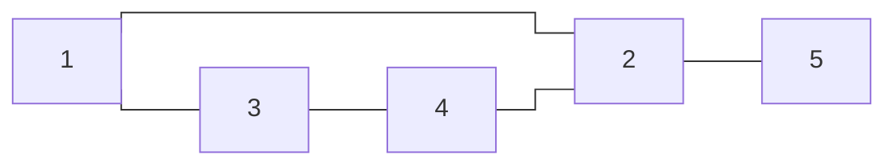
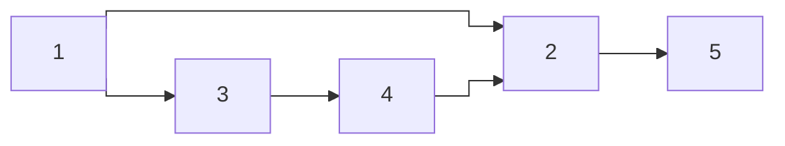
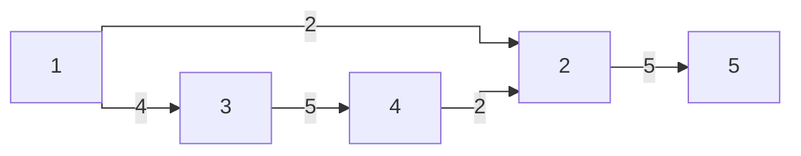

# 그래프와 인접행렬

1. 무방향 그래프

```mermaid
%%{ init: { 'flowchart': { 'curve': 'stepBefore' } } }%%
flowchart LR
    1 --- 2
    1 --- 3
    3 --- 4
    4 --- 2
    2 --- 5
```

2. 방향 그래프

```mermaid
%%{ init: { 'flowchart': { 'curve': 'stepBefore' } } }%%
flowchart LR
    1 --> 2
    1 --> 3
    3 --> 4
    4 --> 2
    2 --> 5
```

3. 가중치 방향그래프

```mermaid
%%{ init: { 'flowchart': { 'curve': 'stepBefore' } } }%%
flowchart LR
    1 -- 2 --> 2
    1 -- 4 --> 3
    3 -- 5 --> 4
    4 -- 2 --> 2
    2 -- 5 --> 5
```
